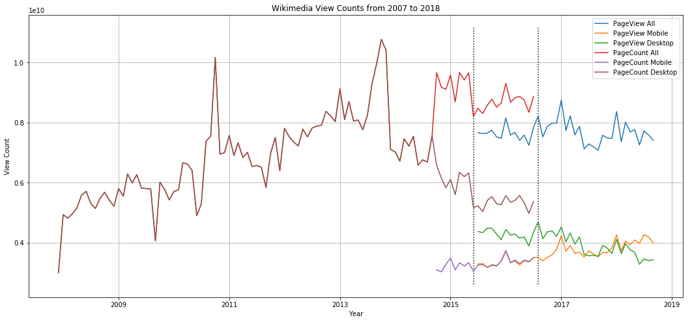

# Human Centered Data Science - A1: Data Curation

The goal of this repository is to construct, analyze, and publish a dataset of monthly traffic on English Wikipedia from January 1 2008 through September 30 2018.

## API Documentation

I have used two APIs for collecting data:
1. The (Legacy) Page Count API, at monthly granularity: [Documentation](https://wikitech.wikimedia.org/wiki/Analytics/AQS/Legacy_Pagecounts#Pagecounts)  
2. The Page View API, at monthly granularity:  [Documentation](https://wikitech.wikimedia.org/wiki/Analytics/AQS/Pageviews#Monthly_counts)

## Directory Structure

```
.
├── csv
│   └── en-wikipedia_traffic_200712-201809.csv
├── json
│   ├── pagecounts_desktop-site_2007120100-2016080100.json
│   ├── pagecounts_mobile-site_2007120100-2016080100.json
│   ├── pageviews_desktop_2015070100-2018100100.json
│   ├── pageviews_mobile-app_2015070100-2018100100.json
│   └── pageviews_mobile-web_2015070100-2018100100.json
├── README.md
└── hcds-a1-data-curation.ipynb  
```

## CSV Data Description

| Column | Description |
|--------|-------------|
| `year`   | The year of the data point |
| `month`  | The month of the data point. The year-month pair serve as a key |
| `pageview_mobile_views` | The number of views as recorded by mobile (app + web) visits |
| `pageview_desktop_views` | The number of views as recorded by desktop site (web) visits |
| `pagecount_mobile_views` | The number of views as recorded by mobile visits by the legacy API |
| `pagecount_desktop_views` | The number of views as recorded by desktop site visits |
| `pageview_all_views` | The total number of views as recorded by the PageView API |
| `pagecount_all_views` | The total number of views as recorded by the Page Count API |

## Miscellaneous

1. The Page Views API provides a mechanism to filter by user agent. As a result, the final dataset has the minor anomaly that the Page Count values include bots (spiders/crawlers/etc), whereas the Page Views API does not.

## Visualization



## License

This code is available under the [MIT License](LICENSE)

Wikimedia [Terms of Use](https://foundation.wikimedia.org/wiki/Terms_of_Use/en)
